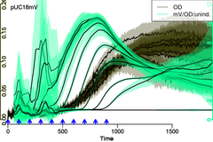

# `platexpress` - Microbial Growth & Gene Expression





The platexpress package provides a quick & easy interface to microbial
growth & gene expression data as measured in parallel growth platforms
such as microplate readers. It allows for quick inspection of raw
data, blank normalization, and summarization over replicates.

A few data conversion routines allow to interface other R
packages for analysis of microbial growth such as
[grofit](https://cran.r-project.org/web/packages/grofit/index.html)
and 
[growthcurver](https://cran.r-project.org/web/packages/growthcurver/index.html)
(TODO) and quickly display their results within `platexpress`.


## Installation

`platexpress` is currently under heavy development and there is no official
release yet. You can download from github and run:

```
R CMD build platexpress/
R CMD INSTALL platexpress_0.1.tar.gz
```

or use the library `devtools`:

```R
install.packages("devtools")
library(devtools)
install_github("raim/platexpress")
```


## A Typical Workflow in `platexpress`

NOTE: the following examples are all executed step-by-step in an R
`demo()` that comes with the library. For a quick tour of the following, 
open R and type:

```R
library(platexpress)
demo("demo_ap12",package="platexpress")
``` 

### 1) Parse the plate layout and measurements 

The plate layout will later allow to do blank correction and group
experiments. Here, we take the example file that ships with the 
`platexpress` library:

```R
plate.file <- system.file("extdata", "AP12_layout.csv", package = "platexpress")
plate <- readPlateMap(file=plate.file, blank.id="blank",fsep="\n", fields=c("strain","samples"))
```

... and parse the data, as exported from platereader "Synergy Mx" 
software in the shipped example file:

```R
data.file <- system.file("extdata", "AP12.csv", package = "platexpress")
raw <- readPlateData(file=data.file, type="Synergy", data.ids=c("600","YFP_50:500,535"), time.format="%H:%M:%S", time.conversion=1/3600)
```

Here we include some specifics for this data set. First, we need to
specify from which plate-reader the file was exported. `platexpress`
can currently read files exported from "Synergy Mx" and "BMG Optima"
software. Please let us know, if you need other formats to be
implemented.  Even, if we now the plate-reader some things always
change between exported data sets. E.g., the example file was exported
with times in format HH:MM:SS, and we need to tell it to our parser
via the argument `time.format` (see R base function
`base::strptime`). The resulting time is in seconds but we would prefer
hours, i.e., divide it by 3600. This is done by the `time.conversion`
argument, although in this case you could simply convert it manually
with `raw$Time <- raw$Time/3600` as well.

Generally, parsing a new data file, freshly exported from the
plate-reader or from a spread-sheet program is likely to cause
problems. You should take care at this step. Problems with data
parsing are usually the most time-consuming step in data analysis!

### 2) Inspect and process the raw data

Take a first look:

```R
viewPlate(raw)
```

... and note that there is no growth in well A9, so let's skip it. To
be safe, let's also skip it from the plate layout map.

```R
raw <- skipWells(raw, skip="A9")
plate <- skipWells(plate, skip="A9")
```

... correct for blank well measurements (defined in the plate layout
map!), assign colors and nicer IDs, and view only the present 
rows (A, B and C) and columns (1-9):

```R
data <- correctBlanks(data=raw, plate=plate)
viewPlate(data, rows=c("A","B","C"),cols=1:9)
```

Now the raw data processing is done, so let's assign more informative IDs 
and select nicer colors, as R RGB strings:

```R
data <- prettyData(data=raw,dids=c(OD="600",YFP="YFP_50:500,535"), 
                   colors=c(OD="#000000",YFP=wavelength2RGB(690)))
```

Note that helper functions `showSpectrum()` and `findWavelength(1)`
allow to select colors from a spectrum of visible light and gives
you the required RGB strings. Or you can convert a wavlength in nm
directly to RGB using `wavelength2RGB(500)` for the estimated RGB value
of 500 nm light.

### 3) Group replicates

Next, generate groups over replicates and strains
and view summarized growth vs. expression curves for these groups.
The areas indicate the t-test based 95% confidence interval,
the thick line is the mean, and optionally, you can keep also
the original data in the plot (by choosing a lwd.orig > 0):

```R
groups <- getGroups(plate, by="strain")
viewGroups(data,groups=groups,lwd.orig=0,nrow=1)
```
or view all in one
```R
viewGroups(data,groups2=groups,lwd.orig=0,nrow=1)
```

### 4) Advanced analyses

#### Correct For Lag Phase

The above plots already include a statistical analysis. If the 95% confidence
intervals don't overlap between different groups you already have
your signficant result. However, we can see for the example data
that the lag phase of the group "EVC" is much longer. We could
estimate the lag-phase by using the R package `grofit` (available at CRAN) via
`platexpress` conversion function `data2grofit`. However, here we can see
that a 3 h lag phase for "EVC" wells may do. First we need to assign
a lag-phase to each well, simply by generating an R vector with the well
ID as names. First we need to assign a lag-phase to each well, simply by 
generating an R vector with the well ID as names.

```R
lag <- rep(3, length(groups$EVC))
names(lag) <- groups$EVC
data <- shiftData(data, lag=lag)
viewGroups(data,groups2=groups,lwd.orig=0,nrow=1)
```
Great! Now the OD curves are aligned, and they seem to be very similar,
allowing a direct comparison of fluorescence over time.

#### Generate Box- or Barplots 

For some applications you may want to boil data down to core messages. 
Diverse further functions allow to further summarize and visualize results, 
e.g., 

```R
boxData(data,rng=7,groups=groups,did="YFP")
boxData(data,rng=7,groups=groups,did="YFP",type="bar")
```

gives you boxplots or barplots (with standard errors or 95% confidence
intervals as errors bars) of the selected data at 7 h (or the time-point
closest to 7h).

#### Retrieve and Process Data

The OD growth curves were nicely aligned, however, you may still want to 
normalize your data by OD and look at YFP expression in dependence of OD.
You can `getData` and `addData`, e.g., to calculate YFP/OD:

```R
yfp <- getData(data, "YFP")
od <- getData(data, "OD")
data <- addData(data, dat=yfp/od, ID="YFP/OD", col=wavelength2RGB(459))
viewGroups(data,groups2=groups,lwd.orig=0,dids=c("OD","YFP/OD"))
```

#### Interpolate to new x-axis

You could also plot data against another x-axis, any data set in your
data, e.g., by using `xid="OD"` in the call to `viewPlate` or
`viewGroup`. However, since the x-axis is distinct for each data
point, you won't get the nice 95% confidence intervals. For this we
can interpolate data to a common value. This generates a new data
structure, and the two should not be mixed up:

```R
od.data <- interpolatePlateData(data, xid="OD")
viewGroups(od.data,groups2=groups,dids=c("YFP","YFP/OD"))
```

And now we are ready for nice compact result figure:

```R
boxData(od.data,rng=0.7,groups=groups,did="YFP/OD",type="bar")
```
